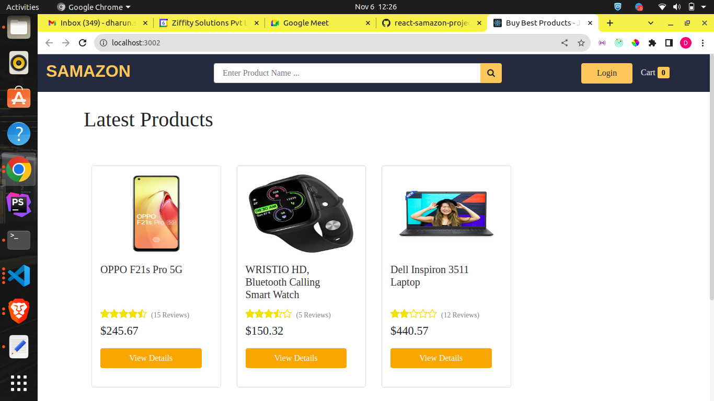
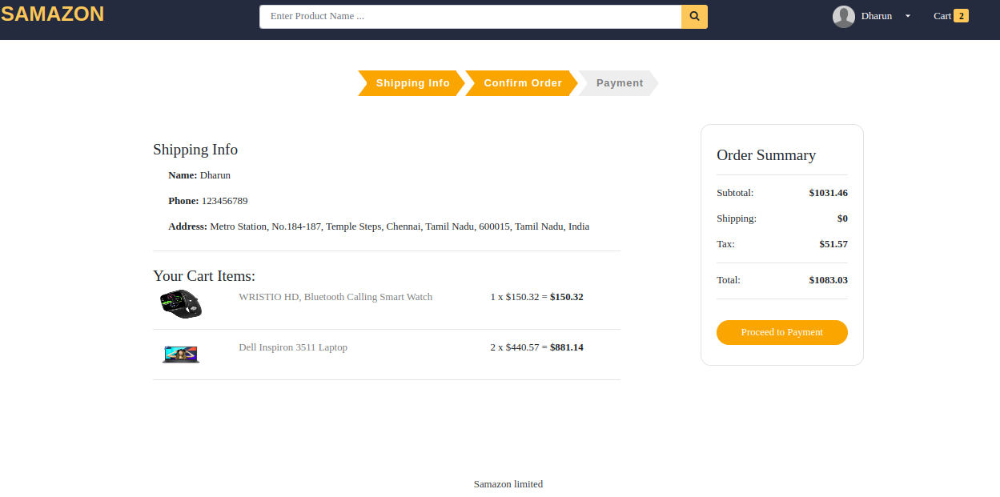
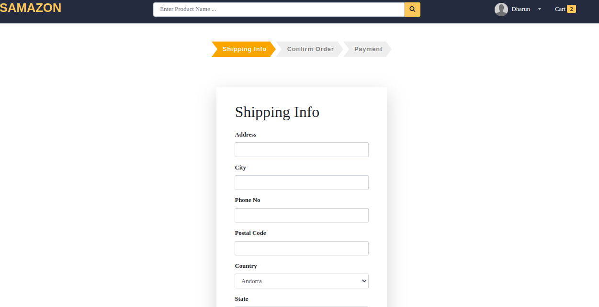
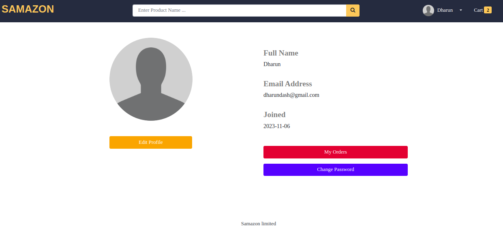

# react-samazon-project
it is a clone of amazon webapp

# how to run
To run the backend: 
```
npm i  
```

``` 
node server.js
 ```

To run the frontend:

```
 cd frontend 
 ```

``` 
npm i
 ```

``` 
npm start 
```


# Features
```
First it displays all the products

Then if we want to get details of the product it shows another pdp page

Admin user can create,update and delete products

Users can create reviews

Once the user selects the product orders are also created
```

# SCREENSHOTS










=======
>>>>>>> origin/react
